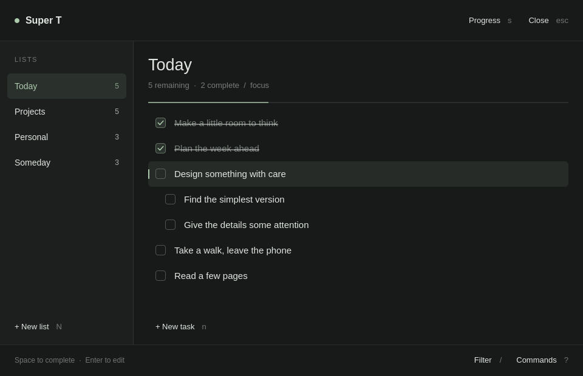

<div align="center">

# Super T

**A little space for what matters.**

A minimal Markdown task manager for the Omarchy desktop.

[](https://github.com/laiambryant/super-T/actions/workflows/ci.yml)
[](https://github.com/laiambryant/super-T/releases)
[](https://omarchy.org/)
[](https://www.python.org/)
[](LICENSE)

[Install](#install) · [User guide](docs/USAGE.md) · [Releases](https://github.com/laiambryant/super-T/releases) · [Contributing](CONTRIBUTING.md)

</div>



Your tasks are plain Markdown files. Super T gives them a quiet, keyboard-driven
home in Omarchy, with your desktop’s colors, typography, and corner style.
The bar widget keeps your open-task count one click away.

- **Keep your files.** One Markdown file per list. Works alongside Obsidian and your editor.
- **Stay on the keyboard.** Navigate, filter, edit, reorder, and move tasks without reaching for the mouse.
- **Organize naturally.** Nested tasks, range selections, subdirectories, and YAML list tags.
- **See your progress.** Per-list completion, daily totals, and a completion streak.
- **Pick up where you left off.** Restored selection, persistent undo, conflict checks, and interrupted-write recovery.
- **Stay local.** No account, cloud service, or Python packages required.

## Install

Requires **Omarchy with the Quickshell plugin shell** and **Python 3.10+**.

```sh
omarchy plugin add https://github.com/laiambryant/super-T.git --enable
```

Choose a bar section when prompted, then click the task count. The default task
directory is `~/Documents/todos`; create your first list with `Shift+N`.

To update or remove the plugin:

```sh
omarchy plugin update liambryant.todo
omarchy plugin remove liambryant.todo
```

Removing the plugin leaves your Markdown files and saved state in place.

For an extracted [release archive](https://github.com/laiambryant/super-T/releases),
run `make install`, then `omarchy plugin enable liambryant.todo --section right`.
Update archive installations by running `make install` from the new release.

## Make it yours

Add or edit this entry in the `plugins` array of
`~/.config/omarchy/shell.json`, preserving your other settings:

```json
{ "id": "liambryant.todo", "dir": "~/Documents/vault/todos" }
```

Subdirectories become lists too: `projects/website.md` appears as
`projects/website`. Files stay readable everywhere:

```markdown
# Today

- [ ] Design something with care
  - [x] Find the simplest version
  - [ ] Give the details some attention
- [ ] Take a walk, leave the phone
```

For **Super+Shift+T**, add a binding to `~/.config/hypr/bindings.lua`:

```lua
o.bind("SUPER + SHIFT + T", "Super T", "omarchy-shell shell toggle liambryant.todo")
```

## Everyday keys

| Key | Action |
| :--- | :--- |
| `h` / `l` or `←` / `→` | Focus lists / tasks |
| `j` / `k` or `↓` / `↑` | Navigate |
| `n` / `Shift+N` | New task / list |
| `Space` / `Enter` | Complete / edit |
| `v` | Select a range |
| `Shift+↑` / `Shift+↓` | Reorder with children |
| `Tab` / `<` | Indent / outdent |
| `m` / `d` / `u` | Move / delete / undo |
| `/` / `t` / `s` | Filter / tags / progress |
| `?` / `Esc` | All commands / back |

Mouse controls are available for creating lists and tasks, filtering, progress,
and help. Click a task to toggle it. See the [user guide](docs/USAGE.md) for
selections, multi-line editing, filtering, and file behavior.

## Develop

Runtime: Qt Quick, Quickshell, Omarchy shell modules, and Python’s standard
library. Tests also use Node.js, `jq`, ShellCheck, and Qt Quick Test.

```sh
make test
make test-qml
make validate
make lint
make test-dist
```

`make link` links the checkout into Omarchy for live development. Tests use
temporary task files and state. See [contributing](CONTRIBUTING.md) and
[architecture](docs/ARCHITECTURE.md) for the development workflow.

## Releases and the marketplace

Pushing a `v<version>` tag runs the complete CI suite and publishes a GitHub
release with a reproducible source archive, SHA-256 checksum, and changelog
notes. The tag must match `manifest.json`. This plugin is interpreted QML and
Python, so the same archive serves supported machine architectures.

Omarchy’s marketplace lists public Git repositories. After publishing the code,
submit its URL through the [official plugin submission form](https://github.com/omacom/omarchy-plugin-marketplace/issues/new?template=submit-plugin.yml).
See the [release guide](docs/RELEASING.md) for the exact steps. A GitHub release
does not submit or approve a marketplace listing automatically.

## License

[MIT](LICENSE).
